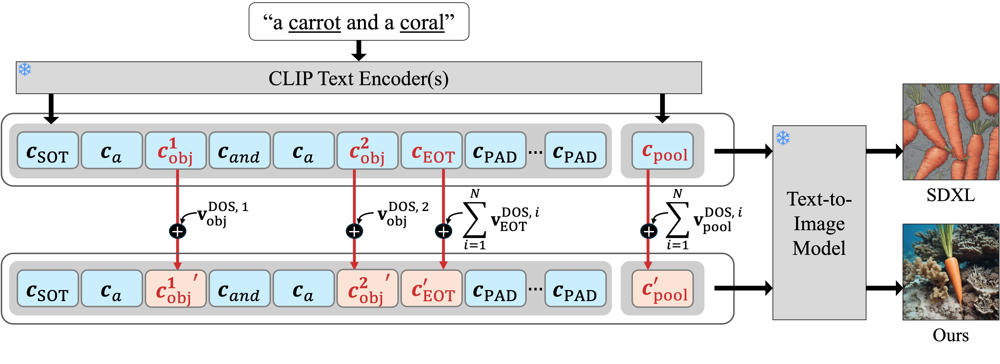

# DOS


[Paper](https://arxiv.org/pdf/2510.14376)

## Prerequisites

The code was tested on a RTX3090 but should work on other cards with at least 24GB VRAM.

```sh
conda env create --file environment.yaml
conda activate dos
pip install -e .
```

**Note**: Please input the valid hugging face token in `./configs/envs.py` before running diffusion models.


## How to test



Please refer to the following notebooks:
- SDXL: `./notebooks/test_dos_sdxl.ipynb`
- SD3.5: `./notebooks/test_dos_sd3.5.ipynb`


## How to run benchmark

```sh

DATASET="similar_shapes"

# SDXL
python run_benchmark.py \
--device cuda:0 \
--output_path outputs/performance_comparison/${DATASET}/sdxl \
--dataset ${DATASET} \
--method sdxl \
--seed_range 1 5

# SDXL with DOS
python run_benchmark.py \
--device cuda:0 \
--output_path outputs/performance_comparison/${DATASET}/sdxl_with_dos \
--dataset ${DATASET} \
--method sdxl_with_dos \
--lambda_sep 1.0 \
--seed_range 1 5
```


## How to evaluate

We measure `gpt-4o-mini`-based __Sucess Rate__ (SR) and __Mixture Rate__ (MR) for the generated images.

```sh
python evaluate_with_vlm.py \
--folder outputs/performance_comparison/similar_shapes/sdxl \
--model openai/gpt-4o-mini \
--api_key {your_open_router_api_key}
```

For more details, please refer to the script `evaluate_with_vlm.py`.


## Citation

``` bibtex
@article{byun2025directional,
  title={DOS: Directional Object Separation in Text Embeddings for Multi-Object Image Generation},
  author={Byun, Dongnam and Park, Jungwon and Ko, Jumgmin and Choi, Changin and Rhee, Wonjong},
  journal={arXiv preprint arXiv:2510.14376},
  year={2025}
}
```